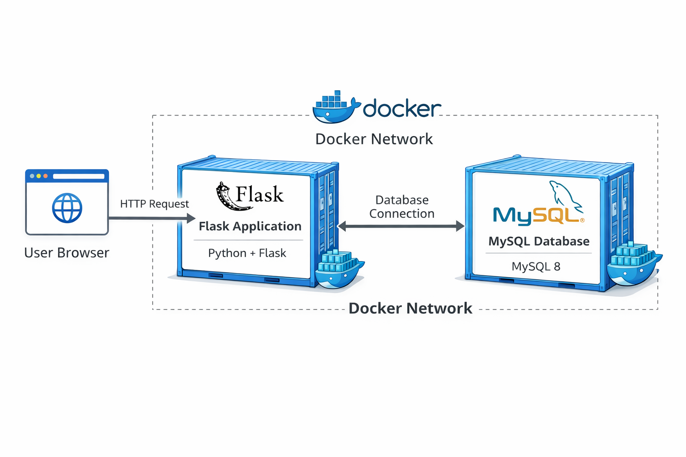

# Flask + MySQL Docker Compose Project

This project demonstrates a simple 2-tier application using Flask and MySQL,
containerized with Docker and orchestrated using Docker Compose.

## Architecture
- Flask (Python) application container
- MySQL database container
- Docker Compose for service orchestration
- Environment variables via .env file
- Persistent MySQL storage using Docker volumes

## Tech Stack
- Python (Flask)
- MySQL 8
- Docker
- Docker Compose v2

## How to Run ->

### Prerequisites
- Docker
- Docker Compose v2

### Steps
```bash
git clone <your-repo-url>
cd flask-mysql-app
docker compose up --build

visit: http://localhost:5000
```

## Architecture Diagram


